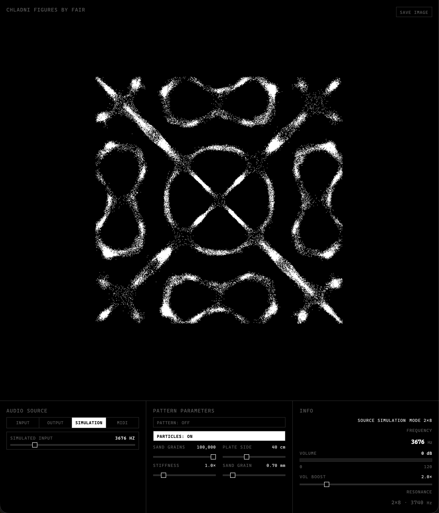

# Chladni Figures



Real-time, audio-driven Chladni-figure particle visualizer. Sand particles slide
along the gradient of a Chladni standing-wave field and settle on the nodal
lines, while the figure **morphs continuously with whatever you are playing**.

> 中文文档见 [README-zh.md](./README-zh.md)。

## Highlights

- **System-output listening (recommended)** — Click `OUTPUT`: the figure follows
  music played by *any* app in real time. When a virtual loopback device is
  detected it is captured **directly** (no popup, auto-restores after refresh);
  otherwise the app falls back to screen-share capture (pick **Entire Screen**
  and tick **Also share system audio**). Adaptive gain normalizes the external
  playback level and a beat detector makes the plate and sand pulse with the drums.
- **System-input listening** — Click `INPUT` to use the microphone or any other
  input device, switchable via the **INPUT DEVICE** selector.
- **MIDI input** — Click `MIDI` to drive the figure from any MIDI keyboard or
  controller in real time; the played note sets the mode/frequency live.
- **Simulation** — Click `SIMULATION` to sweep a synthetic frequency with the
  slider; the app also **emits a matching sine tone** so you can hear the
  frequency you are dialing in.
- **Continuous morphing** — Instead of snapping between discrete modes, the
  `(m, n)` parameters ease smoothly toward spectrum-derived targets every frame.
- **Save as PNG** — The top-right **SAVE IMAGE** button composites the plate
  texture and the WebGL particle layer into a single PNG and downloads it.
- **Multi-language** — The UI follows your browser language automatically
  (currently English / 中文).
- **Monochrome geek aesthetic** — Pure black plate, white nodal lines, white
  particles, fixed-position HUD.

## Architecture

```
index.html        UI markup + module entry
styles.css        black/white HUD styling (16/8/4 spacing tiers)
src/
  main.js         state, loop, spectrum→(m,n) mapping, persistence
  audio.js        AudioEngine: sources (mic/output/sim/midi) + FFT band analysis
  chladni.js      pure math: ψ(u,v,m,n), gradient, freq→mode
  particles.js    height-map particle physics
  render.js       offscreen canvas, plate texture, CPU particle fallback
  render-gl.js    WebGL2 particle layer (overlaid, transparent)
  ui.js           control bindings + per-frame HUD refresh
  i18n.js         locale detection + en/zh dictionaries
```

## Run

ES modules require an HTTP server (not `file://`):

```bash
cd /Users/Fair/Desktop/ChladniFigures
python3 -m http.server 8765
# open http://localhost:8765/index.html
```

or, using the bundled script:

```bash
npm start
```

> Microphone / screen-share / MIDI permissions require a **real browser tab**
> (Chrome or Edge). The in-app preview panel and `file://` open cannot request
> those permissions.

## Controls

- **AUDIO SOURCE**: INPUT / OUTPUT / SIMULATION / MIDI.
- **SIMULATION**: the slider sweeps a synthetic frequency and emits a matching
  tone; the figure follows it live.
- **MIDI**: the played note drives the mode and frequency in real time.
- **GRID**: always `AUTO` — the figure follows the spectrum/frequency in real
  time; manual mode selection has been removed.
- **PATTERN / PARTICLES**: toggle the guide texture and the sand separately.
- **SAVE IMAGE**: download the current view as a PNG.
- **MODE** (top-right readout): shows the current pattern `m×n`.

## Notes

- Preferences (source, frequency, toggles, language) persist in `localStorage`.
- For `INPUT`/`OUTPUT` the audio is analyzed but not played back (no feedback
  loop); `SIMULATION` is the only source that emits sound (the sine tone).
- `OUTPUT` auto-restores after a refresh when using loopback capture; the
  screen-share fallback requires a user gesture, so in that case the app falls
  back to `SIMULATION` (click `OUTPUT` again to resume listening).
- Physics uses the free square-plate Chladni equation; no artificial
  center-node constraint is imposed, so the plate center may show an antinode.

## macOS system-audio capture tips

- **Virtual loopback capture (OUTPUT's preferred path, no popup)**: `OUTPUT`
  auto-detects and uses virtual loopback devices (BlackHole / LarkAudioDevice /
  Squirrels Audio, etc.), switchable via the **OUTPUT DEVICE** selector. Create
  a Multi-Output Device (speakers + the virtual device) in Audio MIDI Setup and
  route system output to it so you can still hear the sound. The selection
  persists across reloads.
- **Screen-share fallback**: with no loopback device, `OUTPUT` uses screen
  share — on Chrome / Edge (macOS 13+) share **Entire Screen** and tick
  "Also share system audio" to hear every app; otherwise share a **tab** with
  "Share tab audio" (only that tab is heard).
- No virtual device? Install [BlackHole](https://existential.audio/blackhole/).
- If sharing succeeds without audio, a toast asks you to retry with the audio
  checkbox; pressing the browser's "Stop sharing" switches back to `SIMULATION`.

## License

[MIT](./LICENSE) © 2026 Fair
